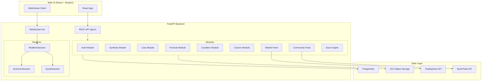
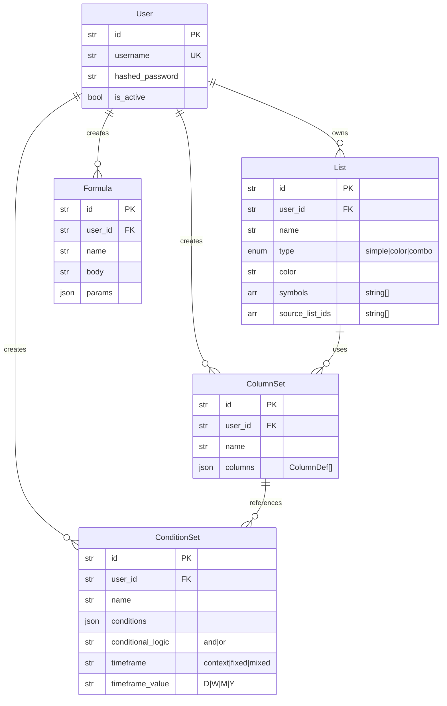
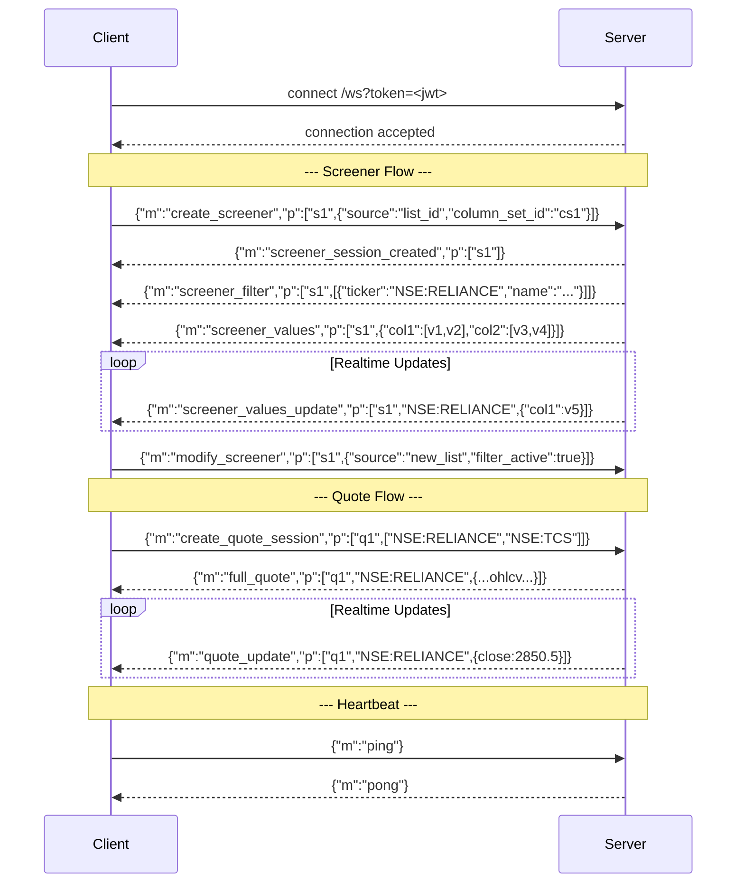
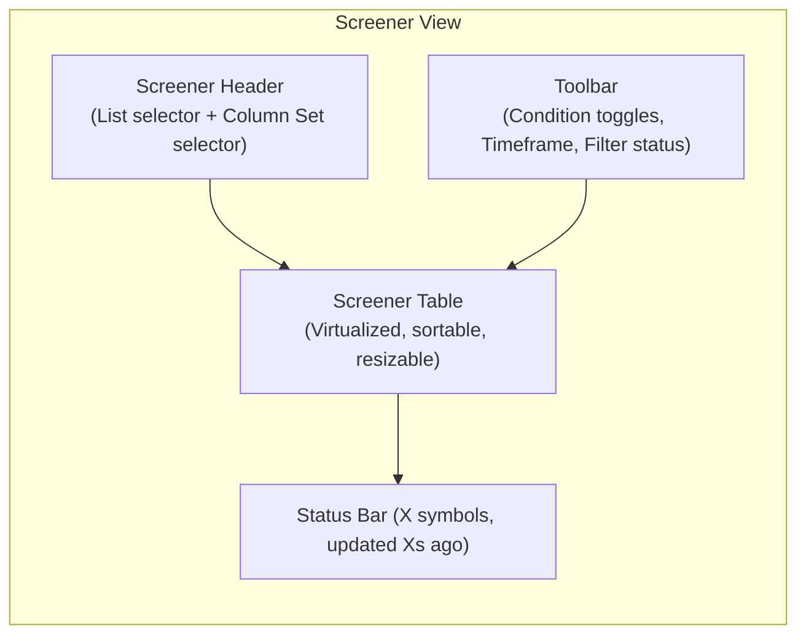
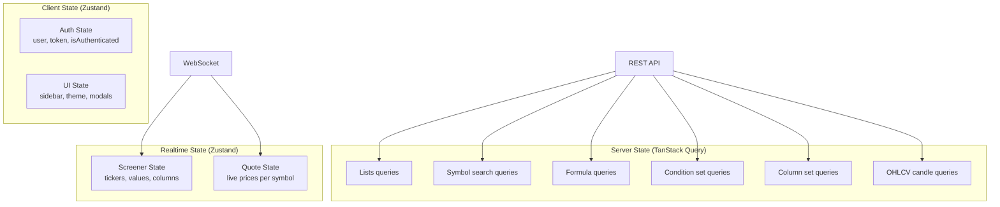

# Terminal — Web UI Architecture & PRD

> A comprehensive system architecture overview and product requirements document for building the **Terminal** web-based UI using **React**, **Shadcn/ui**, and **TailwindCSS**.

---

## 1. System Architecture Overview

### 1.1 Backend Summary

Terminal is a **FastAPI-based financial data platform** that provides:



### 1.2 Backend Modules

| Module | Prefix | Purpose |
|--------|--------|---------|
| **Auth** | `/auth`, `/users` | JWT register/login, user profile |
| **Symbols** | `/symbols` | Search, filter, metadata, TradingView sync |
| **Lists** | `/lists` | Watchlists (simple, color, combo), symbol management |
| **Formula** | `/formula` | User-defined formula CRUD, validation, Monaco editor config |
| **Conditions** | `/conditions` | Reusable condition sets (AND/OR logic with formula expressions) |
| **Columns** | `/columns` | Column set definitions for screener views |
| **Market Feed** | `/market-feeds` | OHLCV candle data, daily refresh |
| **Community** | `/community` | StockTwits global/symbol feeds |
| **Scan Engine** | (internal) | Evaluates formulas across symbols for list scans |

### 1.3 Data Model Map



### 1.4 WebSocket Realtime Protocol

The system uses a **single multiplexed WebSocket** (`/ws?token=<jwt>`) with typed JSON messages:



**Message Types:**

| Direction | Message | Purpose |
|-----------|---------|---------|
| `C→S` | `ping` | Heartbeat |
| `C→S` | `create_screener` | Create screener session with list + column set |
| `C→S` | `modify_screener` | Update screener params (source, filter, columns) |
| `C→S` | `create_quote_session` | Subscribe to realtime quotes |
| `C→S` | `subscribe_symbols` | Add symbols to quote session |
| `C→S` | `unsubscribe_symbols` | Remove symbols from quote session |
| `S→C` | `pong` | Heartbeat response |
| `S→C` | `screener_session_created` | Session creation confirmation |
| `S→C` | `screener_filter` | Filtered ticker list (with name, logo) |
| `S→C` | `screener_values` | Full column values for all visible tickers |
| `S→C` | `screener_values_update` | Incremental value update for a single symbol |
| `S→C` | `full_quote` | Complete OHLCV snapshot for a symbol |
| `S→C` | `quote_update` | Partial OHLCV diff for a symbol |
| `S→C` | `error` | Error message |

### 1.5 Formula Engine

A **TC2000-style PCF formula language** operating on OHLCV DataFrames:

- **Fields:** `O` (Open), `H` (High), `L` (Low), `C` (Close), `V` (Volume)
- **Functions:** `SMA(src, period)`, `EMA(src, period)`, `MIN(src, period)`, `MAX(src, period)`, `HIGHEST(src, period)`, `LOWEST(src, period)`
- **Operators:** `+`, `-`, `*`, `/`, `>`, `<`, `>=`, `<=`, `==`, `AND`, `OR`
- **Parameters:** Named params with defaults via `@PARAM = value` syntax
- **User Functions:** Saved formulas can be referenced by ID in other formulas
- **Validation:** Real-time validation against live symbol data with result preview

### 1.6 Key Domain Concepts

| Concept | Description |
|---------|-------------|
| **List (Watchlist)** | A collection of symbols. Types: `simple` (flat list), `color` (tagged), `combo` (union of other lists) |
| **Column Set** | Defines what columns appear in the screener. Each column has a formula, type (value/condition/tag), and timeframe |
| **Condition Set** | A group of boolean formula conditions joined by AND/OR logic. Used for filtering |
| **ColumnDef** | Individual column config: `{id, name, type, formula, timeframe, bar_ago, visible, condition_id, filter}` |
| **Screener** | A realtime view combining a List (source symbols) + ColumnSet (what to show) + ConditionSet filters |
| **Scan** | One-shot evaluation of formulas across symbols in a list |

---

## 2. Product Requirements Document (PRD)

### 2.1 Product Vision

Build **Terminal Web** — a professional-grade, Bloomberg Terminal-inspired financial data platform for retail traders. The UI should feel like a modern take on TC2000/TradingView screener, with realtime streaming data, custom formula support, and a highly interactive spreadsheet-like screener.

### 2.2 Target Users

- Active retail traders (India, US equities)
- Technical analysts using custom screener formulas
- Traders who need multi-timeframe analysis with configurable conditions

### 2.3 Tech Stack

| Layer | Technology |
|-------|------------|
| Framework | **React 19** + **TypeScript** |
| Routing | **React Router v7** (or TanStack Router) |
| Styling | **TailwindCSS v4** + **Shadcn/ui** |
| State | **Zustand** (global) + **React Query / TanStack Query** (server state) |
| WebSocket | Custom hook with auto-reconnect + message dispatch |
| Charts | **Lightweight Charts** (TradingView) or **D3.js** |
| Code Editor | **Monaco Editor** (formula editing) |
| Tables | **TanStack Table** (virtualized, sortable, resizable columns) |
| Build | **Vite** |

---

### 2.4 Feature Modules & Pages

#### 2.4.1 Authentication

**Pages:** Login, Register  
**API:** `POST /auth/login`, `POST /auth/register`, `GET /users/me`

| Requirement | Details |
|-------------|---------|
| JWT token stored in memory + httpOnly refresh (or localStorage for MVP) | |
| Protected route wrapper | Redirect to `/login` if unauthenticated |
| User context provider | `useAuth()` hook exposing `user`, `login()`, `logout()`, `isAuthenticated` |

---

#### 2.4.2 Dashboard / Home

The landing page after login. Provides a bird's-eye view of the user's workspace.

| Section | Data Source | Description |
|---------|-------------|-------------|
| **Watchlists Sidebar** | `GET /lists` | Quick-access sidebar listing all user watchlists |
| **Market Overview** | WebSocket quotes | Indices + top movers with live prices |
| **Community Feed** | `GET /community/global/{feed}` | Trending/Popular StockTwits posts |
| **Quick Actions** | — | New List, New Screener, Formula Editor |

---

#### 2.4.3 Screener (Core Feature)

The screener is the **centerpiece** of the application — a realtime, formula-driven stock screening table.



**Layout:**

```
┌─────────────────────────────────────────────────────────┐
│  📊 Screener                                            │
│  [List: Nifty 50 ▼]  [Columns: My Setup ▼]  [⚙ Edit]  │
├─────────────────────────────────────────────────────────┤
│  Filter: [Active ✓]  Timeframe: [D ▼]  Interval: [5s]  │
├──────┬──────────┬───────┬───────┬───────┬───────┬───────┤
│ Tick │ Name     │ Close │ SMA20 │ %Chg  │ Vol   │ Cond  │
├──────┼──────────┼───────┼───────┼───────┼───────┼───────┤
│ RELI │ Reliance │ 2850▲│ 2823  │ +1.2% │ 12.3M │ ✅    │
│ TCS  │ TCS Ltd  │ 4120▼│ 4150  │ -0.5% │ 3.2M  │ ❌    │
│ INFY │ Infosys  │ 1820▲│ 1795  │ +0.8% │ 8.1M  │ ✅    │
│ ...  │ ...      │ ...   │ ...   │ ...   │ ...   │ ...   │
├──────┴──────────┴───────┴───────┴───────┴───────┴───────┤
│ 50 symbols · Filtered: 32 · Last update: 2s ago         │
└─────────────────────────────────────────────────────────┘
```

**Requirements:**

| # | Requirement | Priority |
|---|-------------|----------|
| S1 | Select source list and column set from dropdowns | P0 |
| S2 | Realtime WebSocket screener session (`create_screener` → `screener_filter` → `screener_values`) | P0 |
| S3 | Virtualized table rendering 1000+ rows with TanStack Table | P0 |
| S4 | Live value updates — flash cells on change (green/red animation) | P0 |
| S5 | Column sorting (click header) | P0 |
| S6 | Column resizing (drag header border) | P1 |
| S7 | Toggle filter active/inactive | P0 |
| S8 | Condition status indicator (✅/❌) per row | P1 |
| S9 | Click row → navigate to symbol detail page | P0 |
| S10 | Modify screener (change list/columns) without reconnecting | P1 |
| S11 | Screener status bar (count, filtered count, last update timestamp) | P1 |

**WebSocket Integration:**

```typescript
// Screener hook pseudocode
function useScreener(listId: string, columnSetId: string) {
  const ws = useWebSocket();
  const [tickers, setTickers] = useState<ScreenerFilterRow[]>([]);
  const [values, setValues] = useState<Record<string, any[]>>({});

  useEffect(() => {
    const sessionId = crypto.randomUUID();
    ws.send({
      m: "create_screener",
      p: [sessionId, { source: listId, column_set_id: columnSetId }]
    });

    ws.on("screener_filter", (p) => setTickers(p[1]));
    ws.on("screener_values", (p) => setValues(p[1]));
    ws.on("screener_values_update", (p) => {
      // Merge incremental update for p[1] (symbol)
    });

    return () => ws.send({ m: "destroy_screener", p: [sessionId] });
  }, [listId, columnSetId]);

  return { tickers, values };
}
```

---

#### 2.4.4 Symbol Detail Page

Full detail view for a single symbol. Route: `/symbols/:ticker`

| Section | Component | Data Source |
|---------|-----------|-------------|
| **Header** | Symbol name, ticker, type badge, market | Symbols API |
| **Price Bar** | Live price, change %, high/low | WebSocket `quote_update` |
| **Chart** | Interactive OHLCV candlestick chart | `GET /market-feeds/candles/{symbol}` |
| **Data Table** | OHLCV data in tabular form | Same data as chart |
| **Community** | Symbol-specific StockTwits feed | `GET /community/{symbol}/{feed}` |
| **Actions** | Add to list, set alert | Lists API |

**Chart Requirements:**

| # | Requirement | Priority |
|---|-------------|----------|
| C1 | Candlestick chart with volume overlay | P0 |
| C2 | Timeframe selector (D, W, M, Y) | P0 |
| C3 | Zoom/pan with mouse wheel | P0 |
| C4 | Overlay formula results (SMA, EMA lines) | P1 |
| C5 | Realtime candle updates via WebSocket | P1 |
| C6 | Crosshair with OHLCV tooltip | P0 |

---

#### 2.4.5 Watchlists (Lists)

**API:** Full CRUD on `/lists`

| Feature | Description |
|---------|-------------|
| **List Panel** | Left sidebar showing all watchlists with counts |
| **List Types** | Simple (flat), Color (tagged symbols), Combo (union of lists) |
| **Symbol Add/Remove** | Search + add via symbol search modal, bulk remove |
| **Combo Builder** | Select multiple source lists → combined view |
| **Drag-and-Drop** | Reorder symbols within a list |
| **Color Tags** | Visual color indicator per list |
| **List Actions** | Rename, delete, duplicate |
| **Run Scan** | `POST /lists/{id}/scan` → display scan results inline |

**List Detail View:**

```
┌────────────────────────────────────────────┐
│ 📋 Nifty 50          [📊 Scan] [+ Add] [⋮]│
├────────────────────────────────────────────┤
│ 🟢 NSE:RELIANCE    Reliance Industries     │
│ 🟢 NSE:TCS         TCS Ltd                 │
│ 🔴 NSE:INFY        Infosys                 │
│ 🟢 NSE:HDFCBANK    HDFC Bank               │
│ ...                                        │
├────────────────────────────────────────────┤
│ 50 symbols                                 │
└────────────────────────────────────────────┘
```

---

#### 2.4.6 Formula Editor

A dedicated formula creation and testing environment powered by Monaco Editor.

**API:** `POST /formula/functions`, `GET /formula/functions`, `DELETE /formula/functions/{id}`, `GET /formula/editor-config`, `POST /formula/validate`

**Layout:**

```
┌────────────────────────────────────────────────────────────┐
│  Formula Editor                                            │
├──────────────────────────────┬─────────────────────────────┤
│  📝 Editor (Monaco)         │  📊 Preview                 │
│                              │                             │
│  @D = 20                     │  Symbol: [NSE:RELIANCE ▼]   │
│  @THRESHOLD = 1.05           │                             │
│  C / SMA(C, D) > THRESHOLD  │  Result: boolean            │
│                              │  Last Value: true           │
│                              │  Rows: 256                  │
│                              │                             │
│                              │  ✅ Formula is valid        │
├──────────────────────────────┴─────────────────────────────┤
│  My Formulas                                               │
│  ┌─────────────┬──────────────────────────────┬──────┐     │
│  │ PriceAVGCom │ C / SMA(C, D) > THRESHOLD   │ [🗑] │     │
│  │ VolBreak    │ V > SMA(V, 20) * 2          │ [🗑] │     │
│  └─────────────┴──────────────────────────────┴──────┘     │
└────────────────────────────────────────────────────────────┘
```

**Requirements:**

| # | Requirement | Priority |
|---|-------------|----------|
| F1 | Monaco editor with custom formula language syntax highlighting | P0 |
| F2 | Load editor config from `GET /formula/editor-config` | P0 |
| F3 | Live validation via `POST /formula/validate` with debounce | P0 |
| F4 | Symbol selector for validation target | P0 |
| F5 | Result preview panel (type, last value, row count, errors) | P0 |
| F6 | Save formula as named function | P0 |
| F7 | List and delete saved formulas | P0 |
| F8 | Autocomplete for fields (O, H, L, C, V) and functions (SMA, EMA, etc.) | P1 |
| F9 | Error highlighting with position markers in editor | P1 |
| F10 | Inline documentation/hints on hover | P2 |

---

#### 2.4.7 Condition Set Builder

Visual builder for creating filter condition sets.

**API:** CRUD on `/conditions`

**Layout:**

```
┌──────────────────────────────────────────────────────────────┐
│ Condition Set: "Bullish Breakout"            Logic: [AND ▼]  │
├──────────────────────────────────────────────────────────────┤
│  ┌ Condition 1 ──────────────────────────────────────────┐   │
│  │  Formula: [ C > SMA(C, 50)              ]  TF: [D ▼]│   │
│  └───────────────────────────────────────────────────────┘   │
│  ┌ Condition 2 ──────────────────────────────────────────┐   │
│  │  Formula: [ V > SMA(V, 20) * 1.5        ]  TF: [D ▼]│   │
│  └───────────────────────────────────────────────────────┘   │
│  [+ Add Condition]                                           │
├──────────────────────────────────────────────────────────────┤
│  Timeframe Mode: [● Context  ○ Fixed  ○ Mixed]              │
│                                                              │
│  [Save]  [Delete]                                            │
└──────────────────────────────────────────────────────────────┘
```

**Requirements:**

| # | Requirement | Priority |
|---|-------------|----------|
| CD1 | List all condition sets | P0 |
| CD2 | Create new condition set with name + logic (AND/OR) | P0 |
| CD3 | Add/remove conditions (formula + timeframe per condition) | P0 |
| CD4 | Timeframe mode selector (context/fixed/mixed) | P0 |
| CD5 | Inline formula validation for each condition | P1 |
| CD6 | Delete condition set | P0 |

---

#### 2.4.8 Column Set Builder

Visual builder for defining screener column layouts.

**API:** CRUD on `/columns`

**Column Definition Properties:**

| Property | Type | Description |
|----------|------|-------------|
| `id` | string | Unique column ID |
| `name` | string | Display name |
| `type` | enum | `value` (formula result), `condition` (boolean), `tag` |
| `formula` | string | TC2000-style formula expression |
| `timeframe` | enum | `D`, `W`, `M`, `Y` |
| `bar_ago` | int | Evaluate N bars ago |
| `visible` | bool | Show/hide column |
| `condition_id` | string | Link to a ConditionSet |
| `filter` | enum | `active`, `inactive`, `off` |

**Layout:**

```
┌──────────────────────────────────────────────────────────────┐
│ Column Set: "My Custom View"                                 │
├──────┬──────────┬────────┬─────────────────┬────┬───────────┤
│ Vis  │ Name     │ Type   │ Formula         │ TF │ Filter    │
├──────┼──────────┼────────┼─────────────────┼────┼───────────┤
│  ✅  │ Close    │ value  │ C               │ D  │ off       │
│  ✅  │ SMA 20   │ value  │ SMA(C, 20)      │ D  │ off       │
│  ✅  │ %Change  │ value  │ (C - C1) / C1   │ D  │ active    │
│  ✅  │ Bullish  │ cond   │ —               │ —  │ active    │
│  ❌  │ Volume   │ value  │ V               │ D  │ off       │
├──────┴──────────┴────────┴─────────────────┴────┴───────────┤
│ [+ Add Column]          [Save]  [Delete]                     │
└──────────────────────────────────────────────────────────────┘
```

---

#### 2.4.9 Symbol Search

Global symbol search accessible from the header or as a modal.

**API:** `GET /symbols/q?q=&market=&type=&index=&limit=`

| Feature | Description |
|---------|-------------|
| **Command Palette** | `Cmd+K` shortcut opens search modal |
| **Search Input** | Searches by ticker, name, or ISIN |
| **Filters** | Market (india/america), Type (stock/etf), Index |
| **Results** | Ticker, name, type badge, market flag |
| **Actions** | Click → navigate to symbol detail, right-click → add to list |
| **Metadata** | Uses `/symbols/search_metadata` for filter dropdown values |

---

#### 2.4.10 Community Feed

Social sentiment from StockTwits.

**API:** `GET /community/global/{feed}`, `GET /community/{symbol}/{feed}`

| Feature | Description |
|---------|-------------|
| **Global Feed** | Trending, Suggested, Popular tabs |
| **Symbol Feed** | Context-specific feed on symbol detail page |
| **Cards** | Author avatar, message, timestamp, sentiment indicators |

---

### 2.5 Application Architecture

#### 2.5.1 Folder Structure

```
src/
├── app/
│   ├── layout.tsx              # Root layout with providers
│   ├── routes/
│   │   ├── login.tsx
│   │   ├── register.tsx
│   │   ├── dashboard.tsx
│   │   ├── screener.tsx
│   │   ├── symbols/
│   │   │   └── [ticker].tsx
│   │   ├── lists/
│   │   │   └── [id].tsx
│   │   ├── formulas/
│   │   │   └── editor.tsx
│   │   ├── conditions/
│   │   │   └── builder.tsx
│   │   └── columns/
│   │       └── builder.tsx
│   └── providers.tsx           # Compose all providers
├── components/
│   ├── ui/                     # Shadcn/ui components
│   ├── layout/
│   │   ├── app-sidebar.tsx
│   │   ├── header.tsx
│   │   └── command-palette.tsx
│   ├── screener/
│   │   ├── screener-table.tsx
│   │   ├── screener-toolbar.tsx
│   │   ├── screener-cell.tsx
│   │   └── screener-status.tsx
│   ├── chart/
│   │   ├── candlestick-chart.tsx
│   │   └── chart-toolbar.tsx
│   ├── formula/
│   │   ├── formula-editor.tsx
│   │   ├── formula-preview.tsx
│   │   └── formula-list.tsx
│   ├── lists/
│   │   ├── list-sidebar.tsx
│   │   ├── list-detail.tsx
│   │   └── list-combo-builder.tsx
│   ├── conditions/
│   │   ├── condition-set-form.tsx
│   │   └── condition-row.tsx
│   └── columns/
│       ├── column-set-form.tsx
│       └── column-row.tsx
├── hooks/
│   ├── use-auth.ts
│   ├── use-websocket.ts
│   ├── use-screener.ts
│   ├── use-quote.ts
│   └── use-debounce.ts
├── stores/
│   ├── auth-store.ts           # Zustand: user, token
│   ├── screener-store.ts       # Zustand: active screener state
│   └── ui-store.ts             # Zustand: sidebar, theme, modals
├── lib/
│   ├── api.ts                  # Axios/fetch wrapper with auth interceptor
│   ├── ws.ts                   # WebSocket client with reconnect
│   ├── constants.ts
│   └── utils.ts
├── types/
│   ├── api.ts                  # REST API request/response types
│   ├── ws.ts                   # WebSocket message types
│   └── models.ts               # Domain model interfaces
└── styles/
    └── globals.css             # TailwindCSS base + custom design tokens
```

#### 2.5.2 State Management Strategy



| State Type | Tool | Why |
|-----------|------|-----|
| **Server state** (REST API data) | TanStack Query | Caching, automatic refetch, deduplication, optimistic updates |
| **Realtime state** (WebSocket streams) | Zustand | WebSocket data is push-based, not request-response. Zustand stores can be updated outside React lifecycle |
| **Client state** (UI, auth) | Zustand | Simple, lightweight, no boilerplate |

#### 2.5.3 WebSocket Architecture

```typescript
// lib/ws.ts — Core WebSocket client

interface WSMessage {
  m: string;
  p?: any[];
}

type MessageHandler = (message: WSMessage) => void;

class TerminalWebSocket {
  private ws: WebSocket | null = null;
  private handlers = new Map<string, Set<MessageHandler>>();
  private reconnectAttempts = 0;
  private maxReconnectAttempts = 10;
  private pingInterval: number | null = null;

  connect(token: string): void {
    this.ws = new WebSocket(`ws://${host}/ws?token=${token}`);
    this.ws.onmessage = (event) => {
      const msg: WSMessage = JSON.parse(event.data);
      this.handlers.get(msg.m)?.forEach(h => h(msg));
    };
    this.startPingLoop();
  }

  on(messageType: string, handler: MessageHandler): () => void { /* ... */ }
  send(msg: WSMessage): void { /* ... */ }
  disconnect(): void { /* ... */ }
}
```

---

### 2.6 UI/UX Design Principles

| Principle | Application |
|-----------|-------------|
| **Data Density** | Show maximum information in minimum space. Inspired by Bloomberg/TC2000 |
| **Realtime Feedback** | Flash cells on value change, animated transitions, live counters |
| **Dark Mode First** | Professional traders prefer dark UI. Default theme is dark |
| **Keyboard-First** | `Cmd+K` search, table keyboard nav, shortcuts for common actions |
| **Progressive Disclosure** | Show essential info first, expand for details |
| **Consistent Patterns** | All CRUD entities (lists, formulas, conditions, columns) follow the same UX pattern |

### 2.7 Design System (TailwindCSS + Shadcn)

Colors (Dark Mode Default):

| Token | Value | Usage |
|-------|-------|-------|
| `--background` | `hsl(222, 47%, 6%)` | Main background |
| `--card` | `hsl(222, 47%, 9%)` | Cards, panels |
| `--muted` | `hsl(217, 33%, 17%)` | Muted backgrounds |
| `--accent` | `hsl(210, 100%, 52%)` | Primary blue accent |
| `--success` | `hsl(142, 71%, 45%)` | Price up, bullish |
| `--destructive` | `hsl(0, 72%, 51%)` | Price down, bearish, delete |
| `--warning` | `hsl(38, 92%, 50%)` | Warnings, pending |
| `--chart-1` to `--chart-5` | Various | Chart series colors |

---

### 2.8 Page-by-Page Routing

| Route | Page | Auth |
|-------|------|------|
| `/login` | Login page | ❌ |
| `/register` | Register page | ❌ |
| `/` | Dashboard (redirects to `/screener`) | ✅ |
| `/screener` | Main screener view | ✅ |
| `/symbols/:ticker` | Symbol detail page | ✅ |
| `/lists` | All lists view | ✅ |
| `/lists/:id` | List detail view | ✅ |
| `/formulas` | Formula editor | ✅ |
| `/conditions` | Condition set builder | ✅ |
| `/columns` | Column set builder | ✅ |
| `/community` | Community feed | ✅ |

---

### 2.9 API Client Design

```typescript
// lib/api.ts
import axios from 'axios';

const api = axios.create({
  baseURL: '/api/v1',
  headers: { 'Content-Type': 'application/json' },
});

// Auth interceptor
api.interceptors.request.use((config) => {
  const token = useAuthStore.getState().token;
  if (token) config.headers.Authorization = `Bearer ${token}`;
  return config;
});

// Typed API functions
export const symbolsApi = {
  search: (params: SymbolSearchParams) => 
    api.get<SearchResultResponse>('/symbols/q', { params }),
  metadata: () => api.get('/symbols/search_metadata'),
};

export const listsApi = {
  all: () => api.get<ListPublic[]>('/lists'),
  get: (id: string) => api.get<ListPublic>(`/lists/${id}`),
  create: (data: ListCreate) => api.post<ListPublic>('/lists', data),
  update: (id: string, data: ListUpdate) => api.put<ListPublic>(`/lists/${id}`, data),
  appendSymbols: (id: string, symbols: string[]) => 
    api.post(`/lists/${id}/append_symbols`, { symbols }),
  removeSymbols: (id: string, symbols: string[]) =>
    api.post(`/lists/${id}/bulk_remove_symbols`, { symbols }),
  scan: (id: string) => api.post(`/lists/${id}/scan`),
};

export const formulaApi = {
  all: () => api.get<FormulaPublic[]>('/formula/functions'),
  create: (data: FormulaCreate) => api.post<FormulaPublic>('/formula/functions', data),
  delete: (id: string) => api.delete(`/formula/functions/${id}`),
  validate: (data: FormulaValidateRequest) => 
    api.post<FormulaValidateResponse>('/formula/validate', data),
  editorConfig: () => api.get('/formula/editor-config'),
};

export const conditionsApi = {
  all: () => api.get<ConditionSetPublic[]>('/conditions'),
  get: (id: string) => api.get<ConditionSetPublic>(`/conditions/${id}`),
  create: (data: ConditionSetCreate) => api.post<ConditionSetPublic>('/conditions', data),
  update: (id: string, data: ConditionSetUpdate) => 
    api.put<ConditionSetPublic>(`/conditions/${id}`, data),
  delete: (id: string) => api.delete(`/conditions/${id}`),
};

export const columnsApi = {
  all: () => api.get<ColumnSetPublic[]>('/columns'),
  get: (id: string) => api.get<ColumnSetPublic>(`/columns/${id}`),
  create: (data: ColumnSetCreate) => api.post<ColumnSetPublic>('/columns', data),
  update: (id: string, data: ColumnSetUpdate) => 
    api.put<ColumnSetPublic>(`/columns/${id}`, data),
  delete: (id: string) => api.delete(`/columns/${id}`),
};

export const marketFeedApi = {
  candles: (symbol: string) => api.get(`/market-feeds/candles/${symbol}`),
  refresh: (market: string) => api.post('/market-feeds/refresh', null, { params: { market } }),
};

export const communityApi = {
  globalFeed: (feed: string, limit?: number) => 
    api.get(`/community/global/${feed}`, { params: { limit } }),
  symbolFeed: (symbol: string, feed: string, limit?: number) =>
    api.get(`/community/${symbol}/${feed}`, { params: { limit } }),
};
```

---

### 2.10 Priority & Phases

#### Phase 1 — MVP (Core Loop)

| Feature | Components |
|---------|------------|
| Auth | Login/Register pages, JWT flow |
| Symbol Search | Command palette, search modal |
| Watchlists | List CRUD, symbol add/remove |
| Screener | Realtime screener table with WebSocket |
| Chart | Basic candlestick chart on symbol detail |

#### Phase 2 — Power Tools

| Feature | Components |
|---------|------------|
| Formula Editor | Monaco editor with validation |
| Condition Builder | Visual condition set creation |
| Column Builder | Custom column layout creation |
| Community Feed | StockTwits integration |

#### Phase 3 — Polish & Scale

| Feature | Components |
|---------|------------|
| Advanced Charts | Formula overlays, multi-timeframe |
| Keyboard Shortcuts | Full keyboard navigation |
| Performance | Virtualization, memo, lazy loading |
| Mobile Responsive | Tablet + mobile layouts |
| Themes | Light mode, custom themes |
| Export | CSV/PDF export from screener |

---

### 2.11 Non-Functional Requirements

| Category | Requirement |
|----------|-------------|
| **Performance** | Screener must render 1000+ rows at 60fps with virtualization |
| **Latency** | WebSocket updates should reach the UI within 200ms of server emission |
| **Reconnection** | Auto-reconnect WebSocket with exponential backoff (max 10 attempts) |
| **Accessibility** | WCAG 2.1 AA compliance, keyboard-navigable tables |
| **Security** | JWT stored securely, XSS protection, CORS configured |
| **Browser Support** | Chrome, Firefox, Safari (latest 2 versions) |
| **Bundle Size** | Initial load < 300KB gzipped (lazy load heavy components like Monaco) |
